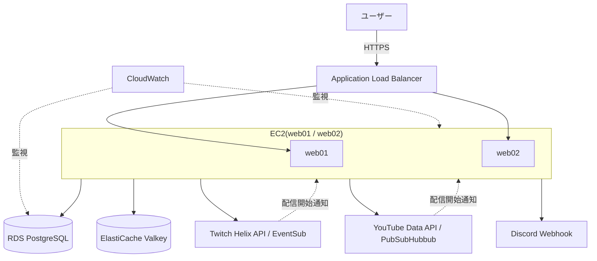

# StreamNotify

Twitch / YouTube の配信開始をリアルタイムに検知し、Discordに自動通知するSpring Bootアプリケーション。

登録した配信者が配信を開始すると、数秒〜数分以内にDiscordへ通知が届きます。Twitch・Googleアカウントでのログイン(OAuth2/OIDC)により、ユーザーごとに好きな配信者を登録・管理できます。

## デモ

https://streamnotify-app.com

<!-- ここにトップページのスクリーンショットを貼る -->
<!--  -->

<!-- ここにダッシュボードのスクリーンショットを貼る -->
<!--  -->

## 主な機能

- Twitch / Googleアカウントでのログイン(OAuth2 / OIDC)
- Twitch・YouTubeチャンネルの検索・登録・削除(1ユーザーあたり最大20件)
- 配信開始のリアルタイム検知
  - Twitch: EventSub(Webhook)
  - YouTube: PubSubHubbub(WebSub)+ Data APIによるライブ判定
- Discordへの自動通知(配信への直接リンク付き)
- 検索結果のキャッシュ(Redis互換のValkey)によるAPIコスト最適化
- CloudWatchによる監視・アラート通知

## アーキテクチャ

- **VPC構成**: パブリック/プライベートサブネットを分離し、EC2・RDS・ElastiCacheはプライベートサブネットに配置
- **可用性**: ALB配下に2台のEC2(web01/web02)を配置し、スティッキーセッションでOAuthフローの一貫性を担保
- **監視**: CloudWatch Agentによるメモリ/ディスク監視、5xxエラー率・RDSリソース逼迫などを検知しSNS経由でメール通知

## 技術スタック

| 分野 | 技術 |
|---|---|
| 言語 / フレームワーク | Java 25, Spring Boot 4.1.0 |
| 認証 | Spring Security(OAuth2 Client), Twitch OIDC, Google OIDC |
| DB | PostgreSQL 18(RDS), Flyway(マイグレーション管理) |
| キャッシュ | Redis互換 Valkey(ElastiCache) |
| 外部API | Twitch Helix API / EventSub, YouTube Data API v3 / PubSubHubbub |
| インフラ | AWS(EC2, ALB, RDS, ElastiCache, CloudWatch, SNS) |
| テスト | JUnit 5, Mockito, AssertJ |

## 配信検知の仕組み

### Twitch

TwitchのEventSub(Webhook)により、配信開始イベントをリアルタイムに受信します。

### YouTube

YouTube Data APIには配信開始を直接通知する仕組みがないため、以下の2段階で実現しています。

1. PubSubHubbub(WebSub)で「動画が投稿・更新された」通知を受信(購読は最大5日で失効するため、4.5日ごとに自動再購読)
2. 通知を受けた動画IDに対し、YouTube Data APIの`videos.list`で`liveStreamingDetails`を確認し、実際に配信中かどうかを判定

## セットアップ

### 必要な環境変数(`.env`)
